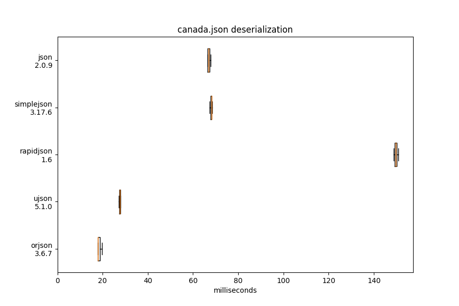
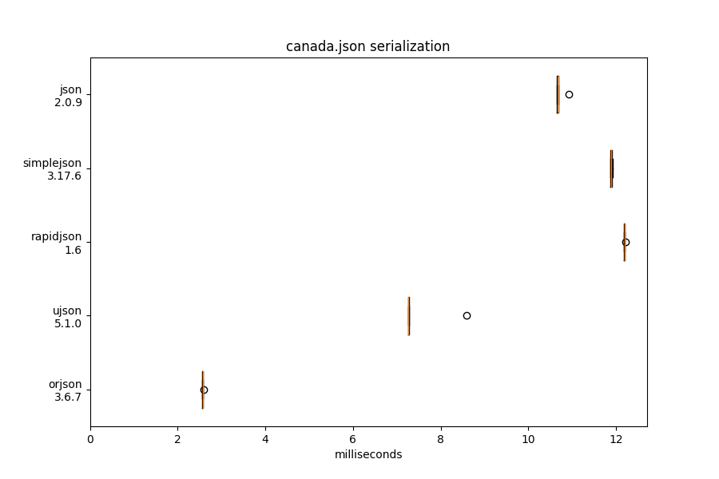
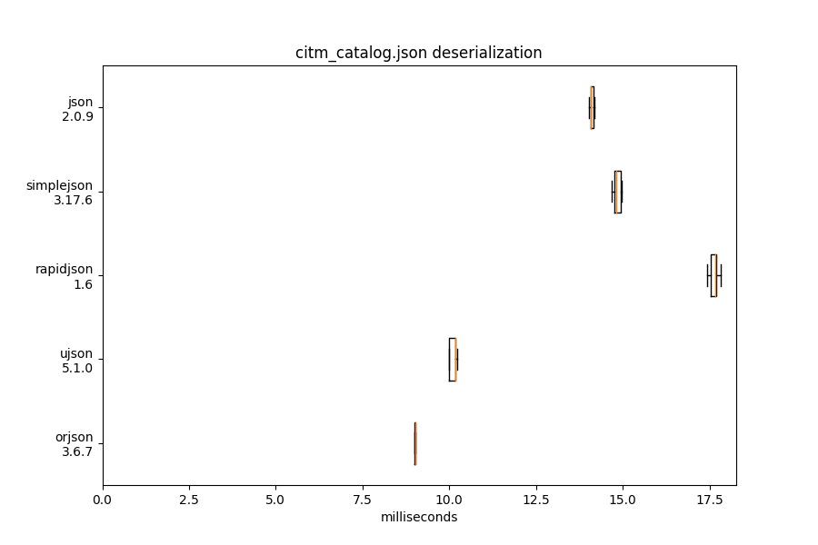
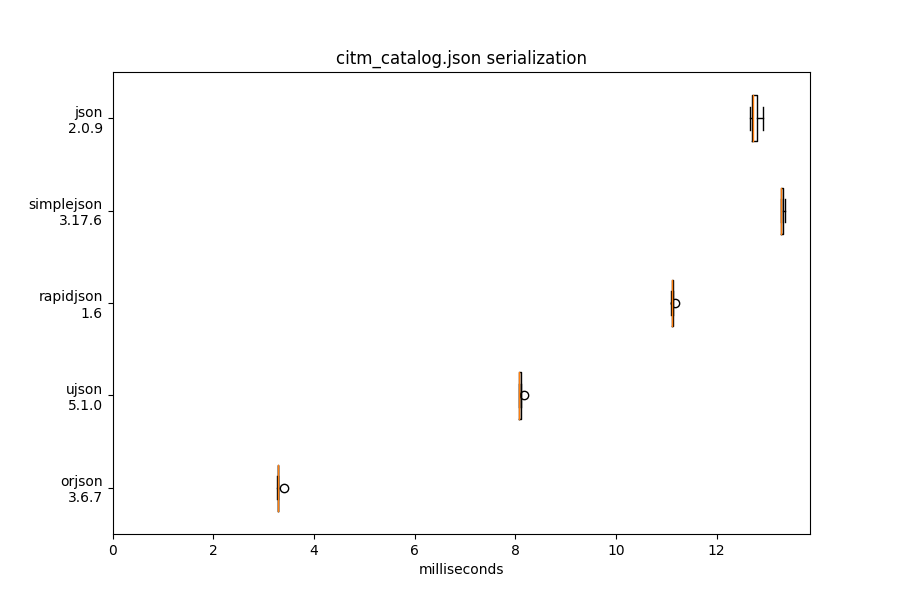
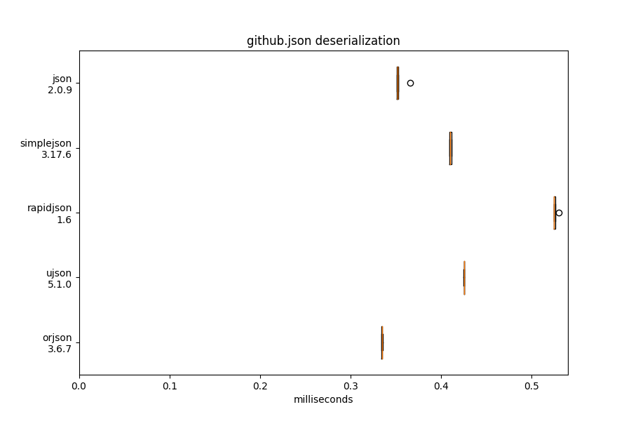
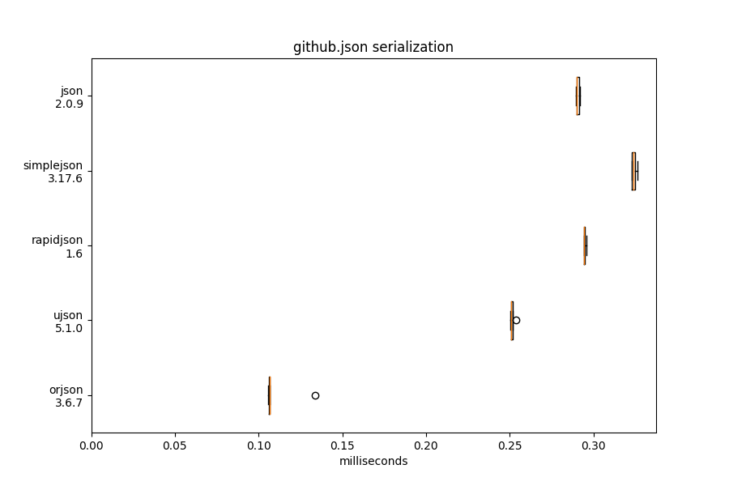
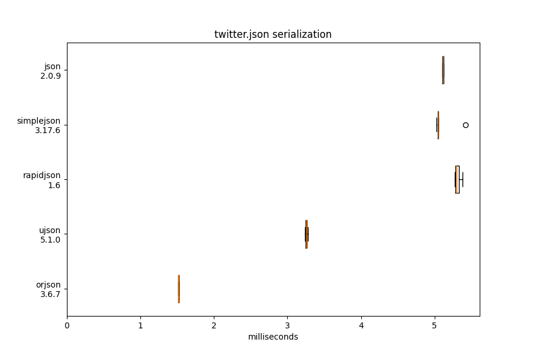

Orjson-Benchmark
================

.. include:: doc/intro.rst

**Reproducing the whole benchmark:** 

.. code-block::

    poetry run tox

Types
================
dataclass
~~~~~~~~~~~
**Reproducing:** 

.. code-block::

    poetry run tox -e dataclass

.. include:: ./doc/types/dataclass/benchmark.rst

datetime
~~~~~~~~~~~
No benchmark available.

enum
~~~~~~~~~~~
No benchmark available.

float
~~~~~~~~~~~
No benchmark available.

int
~~~~~~~~~~~
No benchmark available.

numpy
~~~~~~~~~~~
**Reproducing:** 

.. code-block::

    poetry run tox -e numpy

.. include:: doc/types/numpy/benchmark_int32.rst
.. include:: doc/types/numpy/benchmark_float64.rst
.. include:: doc/types/numpy/benchmark_bool.rst
.. include:: doc/types/numpy/benchmark_int8.rst
.. include:: doc/types/numpy/benchmark_uint8.rst

str
~~~~~~~~~
No benchmark available.

nonstr
~~~~~~~~~
No benchmark available.

uuid
~~~~~~~~~
No benchmark available.

Correctness
================
No benchmark available.

Performance
================
.. include:: doc/performance/performance.rst

Latency
~~~~~~~~~~~
**Reproducing:** 

.. code-block::

    poetry run tox -e setup,update,performance-latency-dumps,performance-latency-loads,graph-benchmark

.. image:: doc/performance/latency/twitter_deserialization.png

.. include:: doc/performance/latency/benchmark.rst

Memory
~~~~~~~~~~~
**Reproducing:** 

.. code-block::

    poetry run tox -e setup,update,performance-memory

.. include:: doc/performance/memory/benchmark.rst

Other
================
Sorting
~~~~~~~~~~~
**Reproducing:** 

.. code-block::

    poetry run tox -e sort

.. include:: doc/sorting/benchmark.rst

Indent
~~~~~~~~~~~
**Reproducing:** 

.. code-block::

    poetry run tox -e indent

.. include:: doc/indent/benchmark.rst