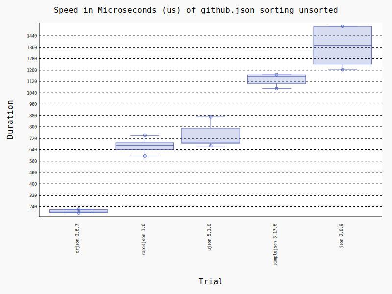

Orjson-Benchmark
================
This repository is a copy of the benchmark to measure the performance and correctness of Python JSON libraries. It was copied and inspired from Orjson_.

.. _Orjson: https://github.com/ijl/orjson

The goal is, using Poetry and Tox, to simplify the execution of the test and thus enable everyone to run the benchmark quickly.

Furthermore, further steps were taken to improve it, such as naming the version used and structuring the readme file into different sub-files.

**Reproducing the whole benchmark:** 

.. code-block::

    poetry run tox

Types
================
dataclass
~~~~~~~~~~~
**Reproducing:** 

.. code-block::

    poetry run tox -e dataclass

.. include:: doc/types/dataclass/benchmark.rst

datetime
~~~~~~~~~~~
No benchmark available.

enum
~~~~~~~~~~~
No benchmark available.

float
~~~~~~~~~~~
No benchmark available.

int
~~~~~~~~~~~
No benchmark available.

numpy
~~~~~~~~~~~
**Reproducing:** 

.. code-block::

    poetry run tox -e numpy

.. include:: doc/types/numpy/benchmark_int32.rst
.. include:: doc/types/numpy/benchmark_float64.rst
.. include:: doc/types/numpy/benchmark_bool.rst
.. include:: doc/types/numpy/benchmark_int8.rst
.. include:: doc/types/numpy/benchmark_uint8.rst

str
~~~~~~~~~
No benchmark available.

nonstr
~~~~~~~~~
No benchmark available.

uuid
~~~~~~~~~
No benchmark available.

Correctness
================
No benchmark available.

Performance
================
Serialization and deserialization performance of orjson is better than ultrajson, rapidjson, simplejson, or json. The benchmarks are done on fixtures of real data:

* twitter.json, 631.5KiB, results of a search on Twitter for "一", containing CJK strings, dictionaries of strings and arrays of dictionaries, indented.

* github.json, 55.8KiB, a GitHub activity feed, containing dictionaries of strings and arrays of dictionaries, not indented.

* citm_catalog.json, 1.7MiB, concert data, containing nested dictionaries of strings and arrays of integers, indented.

* canada.json, 2.2MiB, coordinates of the Canadian border in GeoJSON format, containing floats and arrays, indented.

Latency
~~~~~~~~~~~
**Reproducing:** 

.. code-block::

    poetry run tox -e setup,update,performance-latency-dumps,performance-latency-loads,graph-benchmark

Memory
~~~~~~~~~~~
**Reproducing:** 

.. code-block::

    poetry run tox -e setup,update,performance-memory

.. include:: doc/performance/memory/benchmark.rst

Other
================
Sorting
~~~~~~~~~~~
**Reproducing:** 

.. code-block::

    poetry run tox -e sort

.. raw:: html

    <object data="doc/sorting/image-github.json_sorting_unsorted.svg" type="image/svg+xml"></object>

Indent
~~~~~~~~~~~
**Reproducing:** 

.. code-block::

    poetry run tox -e indent
